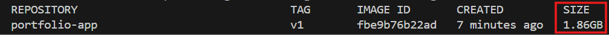
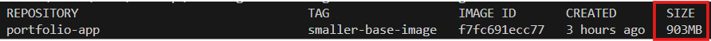
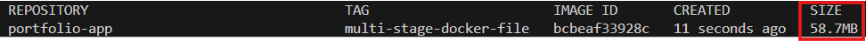

1. Initial docker file
```
FROM node:latest
WORKDIR /app
COPY package*.json ./
RUN npm install
COPY . .
RUN npm run build
EXPOSE 3000
CMD ["npm", "run", "start"]
```


The current image size is 1.86GB

2. Changing to a smaller base image
```
FROM node:alpine
WORKDIR /app
COPY package*.json ./
RUN npm install
COPY . .
RUN npm run build
EXPOSE 3000
CMD ["npm", "run", "start"]

```

The current image size is 903MB (from 1.86GB previously)

Read more about slim vs alpine ()


3. Using a multi-stage Dockerfile and serve with nginx
```
# Stage1: Build
FROM node:alpine AS build
WORKDIR /app
COPY package*.json ./
RUN npm install
COPY . .
RUN npm run build

# Stage2: Serve with nginx
FROM nginx:alpine AS production
RUN rm -rf /usr/share/nginx/html/*
COPY --from=build /app/build /usr/share/nginx/html
EXPOSE 80
CMD ["nginx", "-g", "daemon off;"]
```


The current image size is 59MB (from 903MB previously)